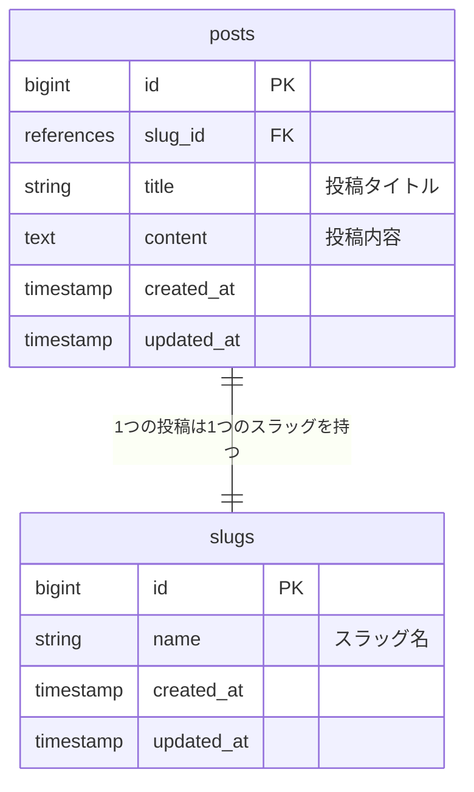

```mermaid
erDiagram
  posts ||--|| slugs: "1つの投稿は1つのスラッグを持つ"

  posts {
    bigint id PK
    references slug_id FK
    string title "投稿タイトル"
    text content "投稿内容"
    timestamp created_at
    timestamp updated_at
  }

  slugs {
    bigint id PK
    string name "スラッグ名"
    timestamp created_at
    timestamp updated_at
  }
```