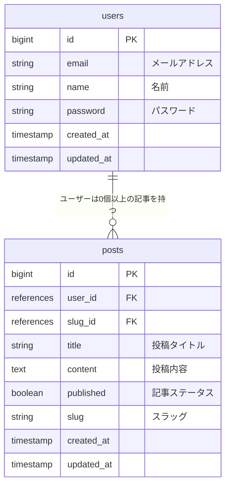

```mermaid
erDiagram
  users ||--o{ posts: "ユーザーは0個以上の記事を持つ"

  users {
    bigint id PK
    string email "メールアドレス"
    string name "名前"
    string password "パスワード"
    timestamp created_at
    timestamp updated_at
  }

  posts {
    bigint id PK
    references user_id FK
    references slug_id FK
    string title "投稿タイトル"
    text content "投稿内容"
    boolean published "記事ステータス"
    string slug "スラッグ"
    timestamp created_at
    timestamp updated_at
  }
```
